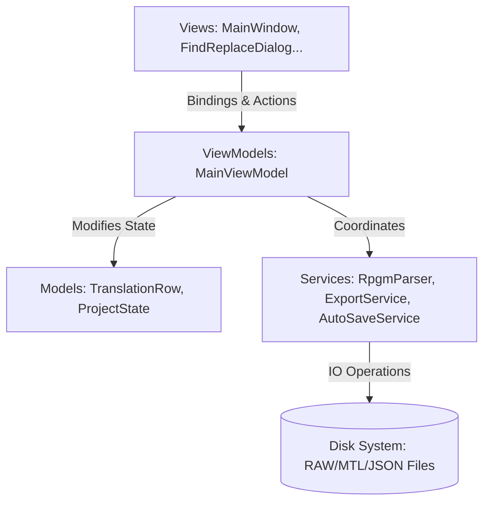
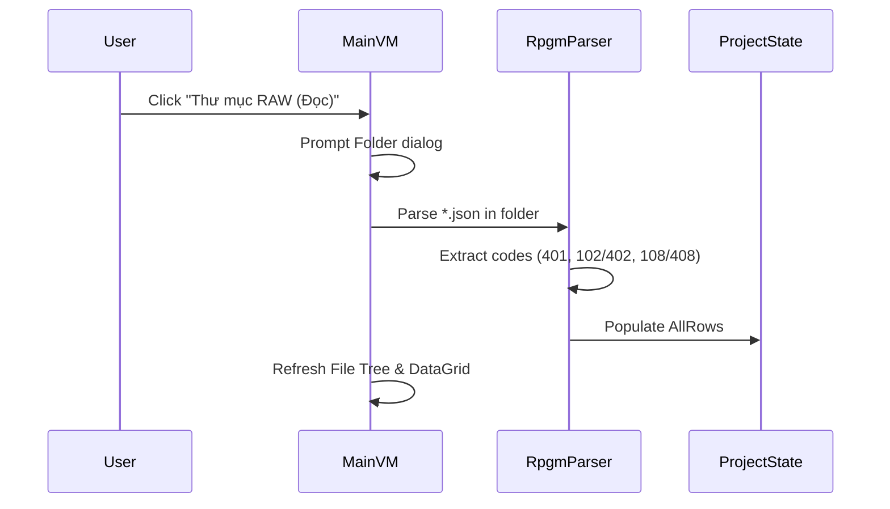
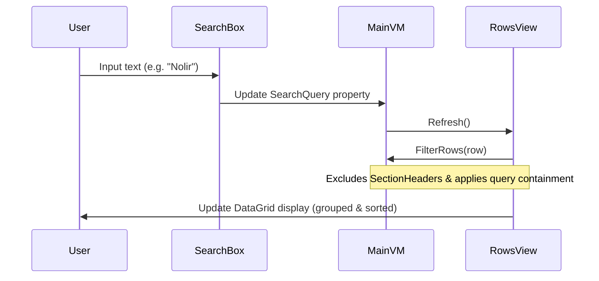
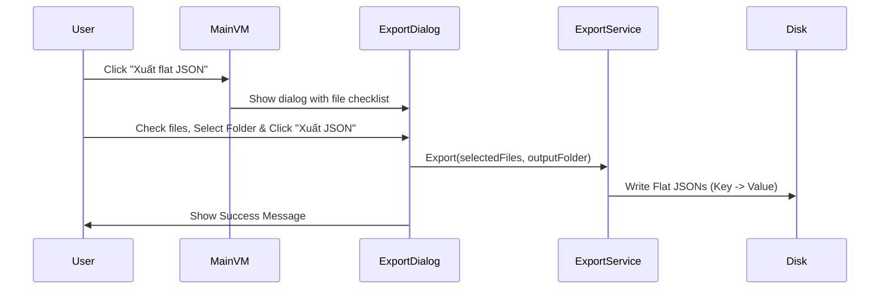

# Nelir RPGM Translator - System Architecture

This document describes the software architecture, core components, and data workflows of **Nelir's RPGM Translator**.

---

## 🏗️ Architecture Overview

The application follows the **Model-View-ViewModel (MVVM)** pattern to separate the UI declaration from the business logic, enabling testability and code maintainability.

---

## 🗂️ Core Components

### 1. Models (Data Layers)
*   [TranslationRow](file:///d:/Shits/Prj/Nelir-RPGM-Translator/Nelir/Models/TranslationRow.cs): Represents a single line of dialogue or choice text extracted from the game files. Contains metadata (`EventId`, `PageIndex`, `CommandIndex`), original speaker, raw text, MTL text, official translation, and dirty flags.
*   [FileNode](file:///d:/Shits/Prj/Nelir-RPGM-Translator/Nelir/Models/FileNode.cs): Represents an item in the sidebar TreeView (either the root folder or individual JSON files). Tracks translation statistics (e.g. `TotalRows`, `TranslatedRows`).
*   [ProjectState](file:///d:/Shits/Prj/Nelir-RPGM-Translator/Nelir/Models/ProjectState.cs): Acts as the in-memory database of the application, holding all loaded `TranslationRow`s and mapping keys.
*   [ExportFileItem](file:///d:/Shits/Prj/Nelir-RPGM-Translator/Nelir/Models/ExportFileItem.cs): Represents a file entry in the selective export window.

### 2. ViewModels (Logic & State Controllers)
*   [MainViewModel](file:///d:/Shits/Prj/Nelir-RPGM-Translator/Nelir/ViewModels/MainViewModel.cs):
    - Manages the application states (`IsProjectLoaded`, `IsBusy`, `FileTree`, `SelectedFile`, `SearchQuery`).
    - Commands: `SelectFolderCommand` (Load RAW), `ImportMtlCommand` (Load MTL), `ExportFlatCommand` (Launch Selective Export).
    - Exposes `RowsView` (WPF `ICollectionView`) configured with a filter predicate (`FilterRows`), grouping descriptions (`SourceFile`), and sort descriptions (`SourceFile` ascending, `RowIndex` ascending).

### 3. Views (UI Layers)
*   [MainWindow](file:///d:/Shits/Prj/Nelir-RPGM-Translator/Nelir/Views/MainWindow.xaml): Host grid, sidebar TreeView, toolbar buttons, and main DataGrid.
*   [FindReplaceDialog](file:///d:/Shits/Prj/Nelir-RPGM-Translator/Nelir/Views/FindReplaceDialog.xaml): Floating dialog for search and replace actions.
*   [ExportSelectionWindow](file:///d:/Shits/Prj/Nelir-RPGM-Translator/Nelir/Views/ExportSelectionWindow.xaml): Directory selection and file checklist popup.

### 4. Services (Business Logic)
*   [RpgmParser](file:///d:/Shits/Prj/Nelir-RPGM-Translator/Nelir/Services/RpgmParser.cs): Decodes RPG Maker MZ/MV JSON files. Extracts dialogue codes (e.g., `401`), choices (`102/402`), and developer comments (`108/408`), resolving name tags via standard regexes (`\\nc<Speaker>Text`).
*   [ExportService](file:///d:/Shits/Prj/Nelir-RPGM-Translator/Nelir/Services/ExportService.cs): Handles exporting selected files to flat translation dictionaries (`UniqueKey` -> `TranslationText`).
*   [AutoSaveService](file:///d:/Shits/Prj/Nelir-RPGM-Translator/Nelir/Services/AutoSaveService.cs): Periodically writes dirty rows to a local hidden backup file (`.nelir_autosave.json`) inside the RAW folder.

---

## 🔄 Key Workflows

### 1. Ingestion Flow (RAW Folder Load)

### 2. Search & Filtering Flow

### 3. Selective Export Flow

